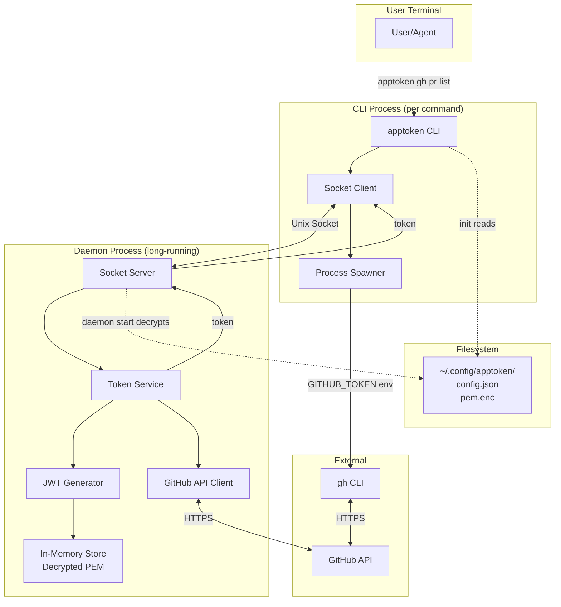
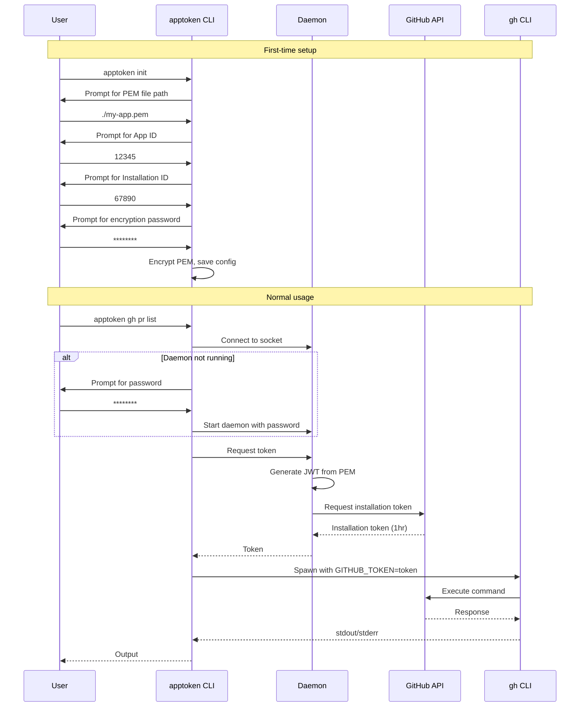

# apptoken - Detailed Design Document

## Overview

`apptoken` is a CLI tool that enables scoped GitHub access for agents running on isolated machines. It authenticates via GitHub Apps (which have limited, configurable permissions) rather than personal access tokens (which grant full access).

The tool uses a daemon architecture to securely manage credentials: the daemon holds decrypted secrets in memory and generates fresh GitHub installation tokens on demand. CLI commands connect to the daemon via Unix socket, receive tokens, and spawn `gh` CLI commands with the token injected as an environment variable—never written to disk.

### Key Value Proposition

- **Scoped access**: GitHub Apps can be configured with limited permissions (e.g., push code but cannot merge PRs)
- **Prompt injection protection**: Tokens never touch disk; compromised agents cannot exfiltrate cached credentials
- **Seamless UX**: `apptoken gh pr list` works like `gh pr list` with automatic authentication

---

## Detailed Requirements

### Functional Requirements

| ID | Requirement | Source |
|----|-------------|--------|
| FR1 | CLI wraps `gh` commands with automatic token injection | Q1, Q2 |
| FR2 | Command structure: `apptoken gh <args>` (direct passthrough) | Q2 |
| FR3 | Interactive wizard for initial setup (`apptoken init`) | Q6 |
| FR4 | Daemon-based architecture with Unix socket communication | Q7 |
| FR5 | Password-encrypted PEM storage at `$XDG_CONFIG_HOME/apptoken/` | Q3, Q5 |
| FR6 | Single GitHub App profile (no multi-profile support initially) | Q4 |
| FR7 | Auto-start daemon if not running when executing commands | Q11 |
| FR8 | Daemon management commands: `start`, `stop`, `status` | Q13 |

### Non-Functional Requirements

| ID | Requirement | Source |
|----|-------------|--------|
| NFR1 | macOS + Linux support (Unix sockets) | Q12 |
| NFR2 | TypeScript with Effect-TS | Original idea |
| NFR3 | Global npm install distribution | Q10 |
| NFR4 | No token caching to disk (prompt injection protection) | Q7 |

### CLI Commands

```
apptoken init                    # Interactive setup wizard
apptoken daemon start            # Start daemon (prompts for password)
apptoken daemon stop             # Stop daemon
apptoken daemon status           # Check if daemon is running
apptoken gh <args>               # Run gh CLI with injected token
```

---

## Architecture Overview



### Process Lifecycle



---

## Components and Interfaces

### 1. CLI Entry Point (`src/cli.ts`)

Main CLI application using `@effect/cli`.

```typescript
// Command structure
const initCommand = Command.make("init", {}, handler)
const daemonCommand = Command.make("daemon", {}).pipe(
  Command.withSubcommands([startCommand, stopCommand, statusCommand])
)
const ghCommand = Command.make("gh", { args: Args.all(Args.text()) }, handler)

const apptoken = Command.make("apptoken", {}).pipe(
  Command.withSubcommands([initCommand, daemonCommand, ghCommand])
)
```

### 2. Config Service (`src/services/ConfigService.ts`)

Manages configuration storage and PEM encryption.

```typescript
interface ConfigService {
  readonly load: () => Effect<AppConfig, ConfigError>
  readonly save: (config: AppConfig) => Effect<void, ConfigError>
  readonly encryptPem: (pem: string, password: string) => Effect<string>
  readonly decryptPem: (encrypted: string, password: string) => Effect<string, DecryptError>
  readonly getConfigPath: () => Effect<string>
}
```

**Storage Location**: `$XDG_CONFIG_HOME/apptoken/` (defaults to `~/.config/apptoken/`)

**Files**:
- `config.json` - App ID, Installation ID, metadata
- `pem.enc` - AES-256-GCM encrypted PEM key

### 3. Daemon Service (`src/services/DaemonService.ts`)

Long-running process that holds secrets and serves token requests.

```typescript
interface DaemonService {
  readonly start: (password: string) => Effect<void, DaemonError>
  readonly stop: () => Effect<void, DaemonError>
  readonly isRunning: () => Effect<boolean>
  readonly getSocketPath: () => string
}
```

**Socket Path**: `$XDG_RUNTIME_DIR/apptoken.sock` or `/tmp/apptoken-{uid}.sock`

### 4. Token Service (`src/services/TokenService.ts`)

Generates GitHub installation tokens.

```typescript
interface TokenService {
  readonly getInstallationToken: () => Effect<InstallationToken, TokenError>
}

interface InstallationToken {
  readonly token: string
  readonly expiresAt: Date
}
```

**Token Flow**:
1. Generate JWT signed with PEM (RS256, 10 min expiry)
2. Call GitHub API: `POST /app/installations/{id}/access_tokens`
3. Return installation token (1 hour expiry)

### 5. Socket Server (`src/services/SocketServer.ts`)

Unix socket server for daemon IPC.

```typescript
interface SocketServer {
  readonly serve: () => Effect<never, SocketError>
}
```

**Protocol** (JSON over Unix socket):

```typescript
// Request
{ "action": "getToken" }

// Success Response
{ "ok": true, "token": "ghs_xxx", "expiresAt": "2024-01-01T12:00:00Z" }

// Error Response
{ "ok": false, "error": "PEM decryption failed" }
```

### 6. Socket Client (`src/services/SocketClient.ts`)

Connects to daemon to request tokens.

```typescript
interface SocketClient {
  readonly requestToken: () => Effect<InstallationToken, SocketError | DaemonNotRunning>
}
```

### 7. Command Executor (`src/services/CommandExecutor.ts`)

Spawns `gh` CLI with token injection.

```typescript
interface CommandExecutor {
  readonly runGh: (
    args: string[],
    token: string
  ) => Effect<CommandResult, CommandError>
}

interface CommandResult {
  readonly exitCode: number
  readonly stdout: string
  readonly stderr: string
}
```

**Environment Injection**:
- `GITHUB_TOKEN` - Primary token env var
- `GH_TOKEN` - Alternative checked by gh CLI

---

## Data Models

### AppConfig

```typescript
interface AppConfig {
  readonly appId: string
  readonly installationId: string
  readonly pemPath: string  // Path to encrypted PEM file
  readonly createdAt: string
}
```

**Stored at**: `~/.config/apptoken/config.json`

### Encrypted PEM Format

```
base64(salt[32] + iv[16] + authTag[16] + ciphertext)
```

- **Algorithm**: AES-256-GCM
- **Key Derivation**: PBKDF2 with SHA-256, 100,000 iterations
- **Salt**: 32 bytes random per encryption
- **IV**: 16 bytes random per encryption

### Socket Messages

```typescript
// Requests
type Request =
  | { action: "getToken" }
  | { action: "ping" }

// Responses
type Response =
  | { ok: true; token: string; expiresAt: string }
  | { ok: true; pong: true }
  | { ok: false; error: string }
```

### Daemon State (In-Memory Only)

```typescript
interface DaemonState {
  readonly decryptedPem: string
  readonly appId: string
  readonly installationId: string
  readonly cachedToken?: {
    readonly token: string
    readonly expiresAt: Date
  }
}
```

**Note**: Cached token is in-memory only (within daemon process), never written to disk. Daemon may cache to avoid unnecessary GitHub API calls while running.

---

## Error Handling

### Error Types

```typescript
// Config errors
class ConfigNotFound extends Data.TaggedError("ConfigNotFound") {}
class ConfigParseError extends Data.TaggedError("ConfigParseError")<{ message: string }> {}

// Encryption errors
class DecryptError extends Data.TaggedError("DecryptError")<{ message: string }> {}
class InvalidPassword extends Data.TaggedError("InvalidPassword") {}

// Daemon errors
class DaemonNotRunning extends Data.TaggedError("DaemonNotRunning") {}
class DaemonAlreadyRunning extends Data.TaggedError("DaemonAlreadyRunning") {}
class SocketError extends Data.TaggedError("SocketError")<{ message: string }> {}

// Token errors
class JwtGenerationError extends Data.TaggedError("JwtGenerationError")<{ message: string }> {}
class GitHubApiError extends Data.TaggedError("GitHubApiError")<{ status: number; message: string }> {}
class TokenExpired extends Data.TaggedError("TokenExpired") {}

// Command errors
class CommandNotFound extends Data.TaggedError("CommandNotFound")<{ command: string }> {}
class CommandFailed extends Data.TaggedError("CommandFailed")<{ exitCode: number; stderr: string }> {}
```

### Error Recovery Strategies

| Error | Recovery |
|-------|----------|
| `DaemonNotRunning` | Auto-start daemon, prompt for password |
| `InvalidPassword` | Prompt to retry (max 3 attempts) |
| `TokenExpired` | Generate fresh token (automatic) |
| `GitHubApiError` (401) | PEM or App ID may be invalid; suggest re-init |
| `SocketError` | Check if daemon crashed; offer to restart |

---

## Testing Strategy

### Unit Tests

Test individual services with mock dependencies using Effect layers.

```typescript
// Example: TokenService test
const MockGitHubApi = Layer.succeed(GitHubApi, {
  requestInstallationToken: () => Effect.succeed({
    token: "ghs_mock",
    expiresAt: new Date(Date.now() + 3600000)
  })
})

const test = TokenService.getInstallationToken().pipe(
  Effect.provide(MockGitHubApi),
  Effect.provide(MockConfigService)
)
```

**Test Coverage**:
- ConfigService: Load/save config, encrypt/decrypt PEM
- TokenService: JWT generation, API call handling
- SocketServer/Client: Message serialization, protocol handling
- CommandExecutor: Environment injection, exit code handling

### Integration Tests

Test daemon lifecycle and CLI commands with real socket communication.

```typescript
// Start daemon, make request, stop daemon
const integrationTest = Effect.gen(function* () {
  const daemon = yield* DaemonService
  yield* daemon.start("test-password")

  const client = yield* SocketClient
  const token = yield* client.requestToken()
  expect(token.token).toMatch(/^ghs_/)

  yield* daemon.stop()
})
```

### E2E Tests

Test full CLI flow with mock GitHub API.

```typescript
// Mock GitHub API server
// Run: apptoken init (with test inputs)
// Run: apptoken daemon start
// Run: apptoken gh auth status
// Verify output
```

---

## Appendices

### A. Technology Choices

| Component | Choice | Rationale |
|-----------|--------|-----------|
| Runtime | Node.js | npm distribution requirement |
| Language | TypeScript + Effect | Type safety, dependency injection, testability |
| CLI Framework | @effect/cli | Native Effect integration, auto-generated help |
| JWT Library | jose | Zero deps, tree-shakeable, RS256 support |
| Encryption | Node.js crypto | Built-in, AES-256-GCM support |
| Sockets | @effect/platform Socket | Stable API, Effect integration |
| Build | tsup or bun build | Fast, ESM output |
| Linting | Oxlint | Fast, zero-config |
| Formatting | Oxfmt (or Prettier) | Prettier-compatible |
| Testing | Vitest + @effect/vitest | Effect integration |

### B. Research Findings Summary

1. **GitHub App Auth Flow**: PEM → JWT (10 min) → Installation Token (1 hour)
2. **Effect Socket API**: Stable since v1.0.0, supports Unix domain sockets
3. **Effect CLI**: Subcommands, auto-help, wizard mode built-in
4. **Daemon Pattern**: `Effect.forkDaemon` + `Effect.forever` + signal handlers

### C. Alternative Approaches Considered

| Approach | Considered | Rejected Because |
|----------|------------|------------------|
| OS Keychain storage | Yes | Adds native deps, prompt injection still possible |
| Token caching to disk | Yes | Prompt injection risk—agent could read file |
| ssh-agent style with timeout | Yes | Added complexity; explicit daemon simpler |
| gh CLI extension | Yes | Different distribution model, less control |
| Environment variable for PEM | Yes | User must manage secret; less secure UX |

### D. Security Considerations

1. **PEM Encryption**: AES-256-GCM with PBKDF2 (100k iterations) protects at rest
2. **Memory-only tokens**: Installation tokens never written to disk
3. **Socket permissions**: Unix socket created with restrictive permissions (0600)
4. **Process isolation**: Token only in `gh` child process env, not parent shell
5. **Password handling**: Password used only to decrypt, not stored

### E. Future Enhancements (Out of Scope)

- Multiple GitHub App profiles
- Library API for programmatic usage
- Token scoping (request specific permissions per command)
- GitHub Enterprise support
- Windows support (named pipes)
