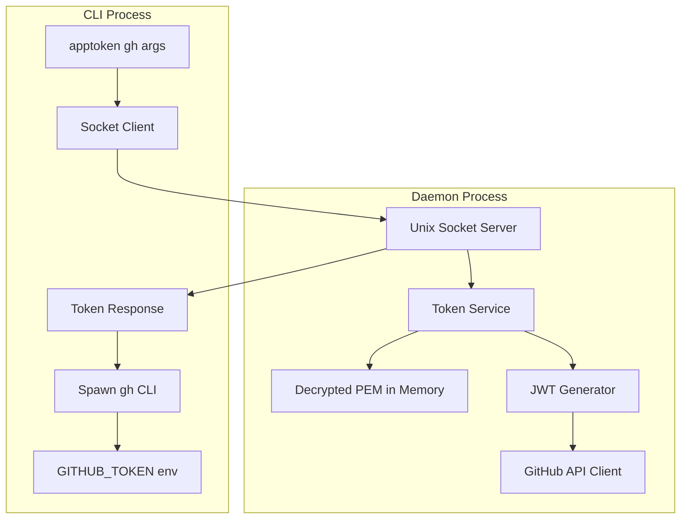

# Daemon & Unix Socket Patterns Research

## Overview

Research on implementing daemon/background processes with Effect-TS for the apptoken CLI.

## 1. Unix Socket Communication

### Current State

**Important:** @effect/platform's Socket module is marked as **Unstable** (still in development). The recommended approach is to wrap Node.js's native `net` module with Effect layers.

### Performance

Unix domain sockets deliver ~50% lower latency than TCP loopback:
- TCP loopback: ~334µs
- Unix domain socket: ~130µs

### Node.js net Module

```typescript
import * as net from "node:net"

// Server
const server = net.createServer((socket) => {
  socket.on("data", (data) => {
    // Handle request
    socket.write(JSON.stringify({ token: "..." }))
  })
})
server.listen("/tmp/apptoken.sock")

// Client
const client = net.connect({ path: "/tmp/apptoken.sock" })
client.write(JSON.stringify({ action: "getToken" }))
```

### Effect Wrapper Pattern

```typescript
import { Context, Effect, Layer } from "effect"
import * as net from "node:net"

// Define service interface
class SocketServer extends Context.Tag("SocketServer")<
  SocketServer,
  {
    readonly start: (path: string) => Effect.Effect<void>
    readonly stop: () => Effect.Effect<void>
  }
>() {}

// Wrap with Effect.async for event-based APIs
const createServer = (path: string) =>
  Effect.async<net.Server, Error>((resume) => {
    const server = net.createServer()
    server.listen(path, () => resume(Effect.succeed(server)))
    server.on("error", (err) => resume(Effect.fail(err)))
  })
```

---

## 2. Effect Patterns for Long-Running Services

### Forking Strategies

| Function | Behavior | Use Case |
|----------|----------|----------|
| `Effect.fork` | Attached to parent scope | Background tasks within request |
| `Effect.forkDaemon` | Global scope, independent | Daemon services |
| `Effect.forkScoped` | Manual scope control | Precise lifetime management |

### Daemon Service Structure

```typescript
import { Effect, Fiber, Console } from "effect"

// Long-running service
const daemonService = Effect.forever(
  Effect.gen(function* () {
    // Handle socket connections, generate tokens, etc.
    yield* handleConnections()
  })
)

// Launch as daemon
const fiber = Effect.runFork(daemonService)

// Graceful shutdown
process.on("SIGINT", () => Effect.runPromise(Fiber.interrupt(fiber)))
process.on("SIGTERM", () => Effect.runPromise(Fiber.interrupt(fiber)))
```

### Resource Cleanup with Finalizers

```typescript
const serverWithCleanup = Effect.gen(function* () {
  const server = yield* createServer("/tmp/apptoken.sock")

  yield* Effect.addFinalizer((exit) =>
    Effect.sync(() => {
      server.close()
      // Clean up socket file
      fs.unlinkSync("/tmp/apptoken.sock")
    })
  )

  return server
})
```

**Key:** Finalizers run regardless of success, failure, or interruption.

---

## 3. Process Spawning with Environment Injection

### @effect/platform Command Module

```typescript
import { Command } from "@effect/platform"
import { NodeContext, NodeRuntime } from "@effect/platform-node"

const runGhCommand = (token: string, args: string[]) =>
  Effect.gen(function* () {
    const command = Command.make("gh", ...args).pipe(
      Command.env({
        GITHUB_TOKEN: token,
        GH_TOKEN: token  // gh CLI checks both
      })
    )

    const output = yield* Command.string(command)
    return output
  })

// Usage
const program = runGhCommand("ghs_xxx", ["pr", "list"])
  .pipe(Effect.provide(NodeContext.layer))

NodeRuntime.runMain(program)
```

### Key Features

- `Command.make(program, ...args)` - Create command
- `Command.env(vars)` - Set environment variables (injected into child only)
- `Command.string(cmd)` - Capture output as string
- `Command.exitCode(cmd)` - Get exit code
- `Command.runInShell(true)` - Run through shell (cross-platform)

---

## 4. Recommended Architecture for apptoken



### Component Breakdown

1. **Daemon Process**
   - Launched with `apptoken daemon start`
   - Prompts for password, decrypts PEM
   - Listens on Unix socket (`/tmp/apptoken.sock` or XDG runtime dir)
   - Handles token generation requests
   - Uses `Effect.forkDaemon` + `Effect.forever`

2. **CLI Client**
   - Connects to daemon via Unix socket
   - Requests fresh installation token
   - Spawns `gh` with `GITHUB_TOKEN` env var
   - Passes through stdout/stderr

### Socket Protocol (Simple JSON)

```typescript
// Request
{ "action": "getToken" }

// Response
{ "token": "ghs_xxx", "expiresAt": "2024-01-01T12:00:00Z" }

// Error
{ "error": "Daemon not initialized" }
```

---

## 5. Password Encryption for PEM Storage

### Using Node.js crypto with AES-256-GCM

```typescript
import * as crypto from "node:crypto"

const ALGORITHM = "aes-256-gcm"
const KEY_LENGTH = 32
const IV_LENGTH = 16
const SALT_LENGTH = 32
const TAG_LENGTH = 16

// Derive key from password
const deriveKey = (password: string, salt: Buffer): Buffer =>
  crypto.pbkdf2Sync(password, salt, 100000, KEY_LENGTH, "sha256")

// Encrypt PEM
const encrypt = (pem: string, password: string): string => {
  const salt = crypto.randomBytes(SALT_LENGTH)
  const key = deriveKey(password, salt)
  const iv = crypto.randomBytes(IV_LENGTH)

  const cipher = crypto.createCipheriv(ALGORITHM, key, iv)
  const encrypted = Buffer.concat([
    cipher.update(pem, "utf8"),
    cipher.final()
  ])
  const tag = cipher.getAuthTag()

  // Format: salt:iv:tag:encrypted (base64)
  return Buffer.concat([salt, iv, tag, encrypted]).toString("base64")
}

// Decrypt PEM
const decrypt = (data: string, password: string): string => {
  const buf = Buffer.from(data, "base64")
  const salt = buf.subarray(0, SALT_LENGTH)
  const iv = buf.subarray(SALT_LENGTH, SALT_LENGTH + IV_LENGTH)
  const tag = buf.subarray(SALT_LENGTH + IV_LENGTH, SALT_LENGTH + IV_LENGTH + TAG_LENGTH)
  const encrypted = buf.subarray(SALT_LENGTH + IV_LENGTH + TAG_LENGTH)

  const key = deriveKey(password, salt)
  const decipher = crypto.createDecipheriv(ALGORITHM, key, iv)
  decipher.setAuthTag(tag)

  return decipher.update(encrypted) + decipher.final("utf8")
}
```

---

## References

- [Node.js net Module](https://nodejs.org/api/net.html)
- [Effect Platform Command](https://effect.website/docs/platform/command/)
- [Effect Fibers](https://effect.website/docs/concurrency/fibers/)
- [Effect Scope](https://effect.website/docs/resource-management/scope/)
- [Unix Domain Socket Performance](https://nodevibe.substack.com/p/the-nodejs-developers-guide-to-unix)
- [sock-daemon npm package](https://github.com/isaacs/sock-daemon)
