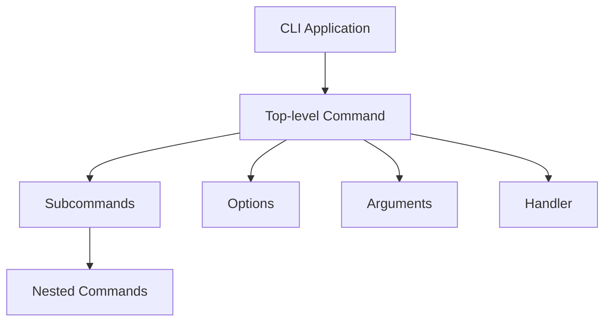

# Effect-TS Patterns Research

## Overview

Effect-TS provides a comprehensive set of primitives for building robust TypeScript applications with proper error handling, dependency injection, and configuration management.

## @effect/cli - CLI Framework

**Source:** [Effect CLI README](https://github.com/Effect-TS/effect/blob/main/packages/cli/README.md)

### Core Concepts



### Basic CLI Structure

```typescript
import { Command, Args, Options } from "@effect/cli"
import { NodeContext, NodeRuntime } from "@effect/platform-node"
import { Console, Effect } from "effect"

// Define arguments
const name = Args.text({ name: "name" })

// Define options
const verbose = Options.boolean("verbose").pipe(Options.withAlias("v"))

// Create command
const myCommand = Command.make("myapp", { name, verbose }, ({ name, verbose }) =>
  Console.log(`Hello, ${name}!`)
)

// Run CLI
const cli = Command.run(myCommand, {
  name: "My App",
  version: "v1.0.0"
})

cli(process.argv).pipe(Effect.provide(NodeContext.layer), NodeRuntime.runMain)
```

### Built-in Features
- `--help` / `-h` - Automatic help generation
- `--version` - Version display
- `--wizard` - Interactive mode
- `--completions (bash|sh|fish|zsh)` - Shell completions

### Subcommands

```typescript
const init = Command.make("init", {}, () => Console.log("Initializing..."))
const generate = Command.make("generate", {}, () => Console.log("Generating..."))

const main = Command.make("apptoken", {}).pipe(
  Command.withSubcommands([init, generate])
)
```

## Configuration with Config

**Source:** [Effect Configuration Docs](https://effect.website/docs/configuration/)

### Loading Environment Variables

```typescript
import { Config, Effect } from "effect"

const program = Effect.gen(function* () {
  const host = yield* Config.string("HOST")
  const port = yield* Config.number("PORT")
})
```

### Handling Secrets with Config.redacted

```typescript
import { Config, Redacted, Effect } from "effect"

const program = Effect.gen(function* () {
  const apiKey = yield* Config.redacted("API_KEY")
  console.log(apiKey) // Output: <redacted>
  const actualValue = Redacted.value(apiKey) // Get real value
})
```

### Default Values and Validation

```typescript
const port = Config.number("PORT").pipe(Config.withDefault(8080))

const name = Config.string("NAME").pipe(
  Config.validate({
    message: "Must be at least 4 characters",
    validation: (s) => s.length >= 4
  })
)
```

## KeyValueStore for Persistence

**Source:** [Effect KeyValueStore Docs](https://effect.website/docs/platform/key-value-store/)

### Overview
The `@effect/platform/KeyValueStore` module provides persistent key-value storage with multiple backends.

### Available Implementations
- `layerMemory` - In-memory (for testing)
- `layerFileSystem` - File-based (for persistence)

### Basic Usage

```typescript
import { KeyValueStore } from "@effect/platform"
import { Effect } from "effect"

const program = Effect.gen(function* () {
  const store = yield* KeyValueStore.KeyValueStore
  yield* store.set("key", "value")
  const value = yield* store.get("key")
})
```

### Schema-Based Type Safety

```typescript
const store = yield* KeyValueStore.KeyValueStore
const typedStore = store.forSchema(MySchema)
yield* typedStore.set("key", myTypedValue)
```

## Dependency Injection Pattern

### Services and Layers

```typescript
import { Context, Effect, Layer } from "effect"

// Define service interface
class TokenStore extends Context.Tag("TokenStore")<
  TokenStore,
  {
    readonly store: (token: string) => Effect.Effect<void>
    readonly retrieve: () => Effect.Effect<string>
  }
>() {}

// Implement service
const TokenStoreLive = Layer.succeed(
  TokenStore,
  {
    store: (token) => Effect.sync(() => { /* ... */ }),
    retrieve: () => Effect.sync(() => { /* ... */ })
  }
)

// Use in program
const program = Effect.gen(function* () {
  const tokenStore = yield* TokenStore
  yield* tokenStore.store("my-token")
})

// Provide implementation
program.pipe(Effect.provide(TokenStoreLive))
```

## Testing with Effect

### Test Layers

```typescript
// Production layer
const TokenStoreLive = Layer.effect(TokenStore, /* real implementation */)

// Test layer
const TokenStoreTest = Layer.succeed(
  TokenStore,
  {
    store: (token) => Effect.succeed(undefined),
    retrieve: () => Effect.succeed("mock-token")
  }
)

// In tests
const testProgram = program.pipe(Effect.provide(TokenStoreTest))
```

## Platform Integration

### Node.js Setup

```typescript
import { NodeContext, NodeRuntime } from "@effect/platform-node"

const program = /* ... */

program.pipe(
  Effect.provide(NodeContext.layer),
  NodeRuntime.runMain
)
```

## References

- [@effect/cli Documentation](https://effect.website/docs/cli/)
- [Effect Configuration](https://effect.website/docs/configuration/)
- [Effect KeyValueStore](https://effect.website/docs/platform/key-value-store/)
- [Effect Platform Introduction](https://effect.website/docs/platform/introduction/)
