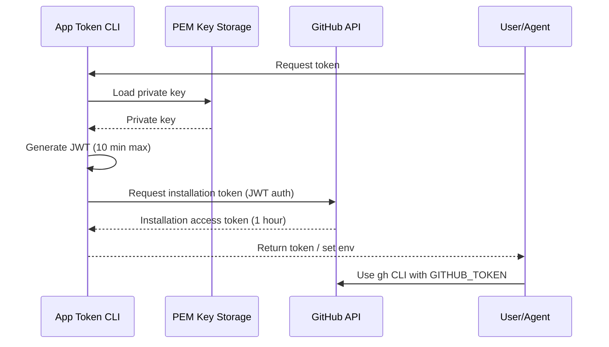

# GitHub App Authentication Research

## Overview

GitHub Apps authenticate differently than personal accounts. They use a two-step process involving JWTs and installation access tokens.

## Authentication Flow



## JWT Generation Requirements

**Source:** [GitHub Docs - Generating a JWT](https://docs.github.com/en/apps/creating-github-apps/authenticating-with-a-github-app/generating-a-json-web-token-jwt-for-a-github-app)

### Algorithm
- **RS256** (RSA-SHA256) - Required

### Required Claims

| Claim | Description | Notes |
|-------|-------------|-------|
| `iat` | Issued At | Recommended: 60 seconds in the past (clock drift protection) |
| `exp` | Expiration | Maximum: 10 minutes in the future |
| `iss` | Issuer | GitHub App's **client ID** (found in app settings) |

### Authentication Header
```
Authorization: Bearer YOUR_JWT
```

**Important:** Must use "Bearer" prefix for JWTs (not "token" like other token types).

## Installation Access Tokens

### Characteristics
- **Lifetime:** 1 hour maximum
- **Scope:** Limited to the permissions granted to the GitHub App
- **Usage:** Set as `GITHUB_TOKEN` environment variable for `gh` CLI

### API Endpoint
```
POST /app/installations/{installation_id}/access_tokens
Authorization: Bearer {JWT}
```

### Response
```json
{
  "token": "ghs_xxxxxxxxxxxxxxxxxxxx",
  "expires_at": "2024-01-01T12:00:00Z",
  "permissions": {
    "issues": "write",
    "contents": "read"
  }
}
```

## Key Insights

1. **Two-token system:** JWT (short-lived, for API auth) → Installation token (1 hour, for actual operations)
2. **Clock drift:** GitHub recommends setting `iat` 60 seconds in the past
3. **Environment integration:** `GITHUB_TOKEN` env var is the standard way to pass tokens to `gh` CLI
4. **Git credential helper:** `gh auth setup-git` configures git to use the token for HTTPS operations

## References

- [About authentication with a GitHub App](https://docs.github.com/en/apps/creating-github-apps/authenticating-with-a-github-app/about-authentication-with-a-github-app)
- [Generating a JWT for a GitHub App](https://docs.github.com/en/apps/creating-github-apps/authenticating-with-a-github-app/generating-a-json-web-token-jwt-for-a-github-app)
